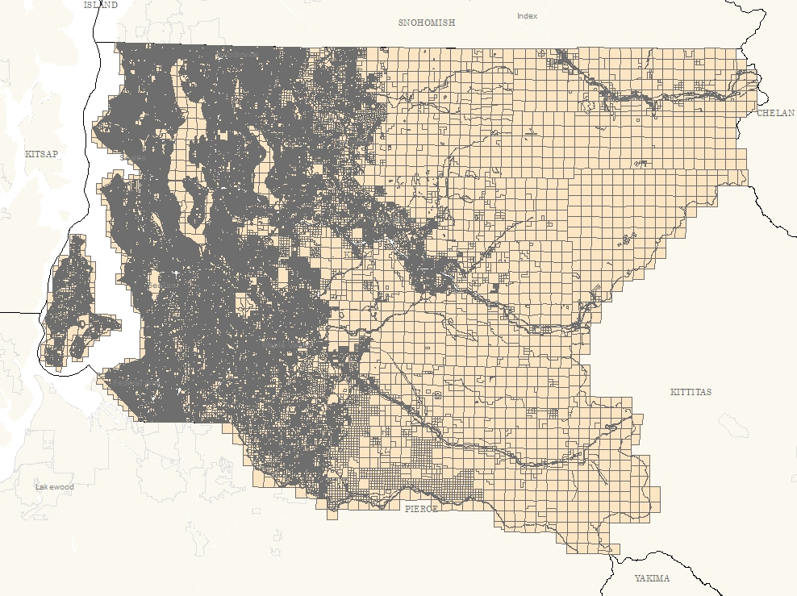
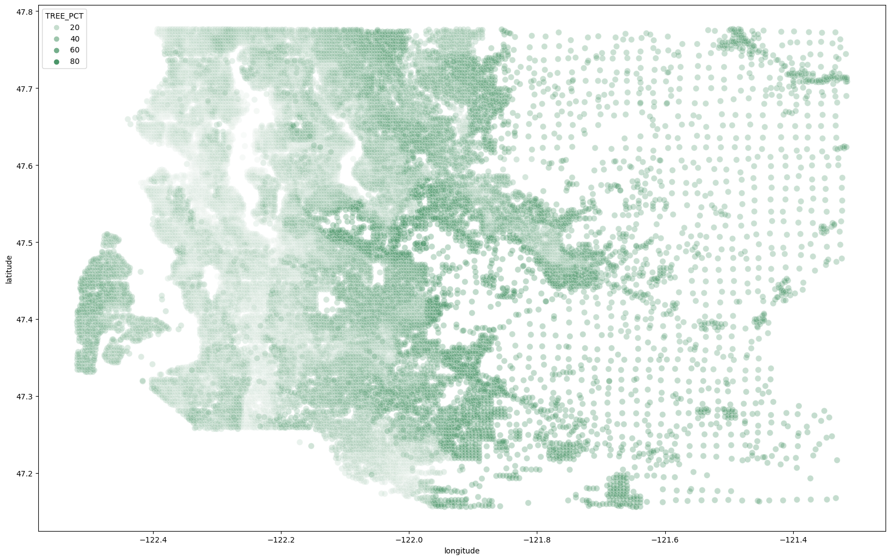
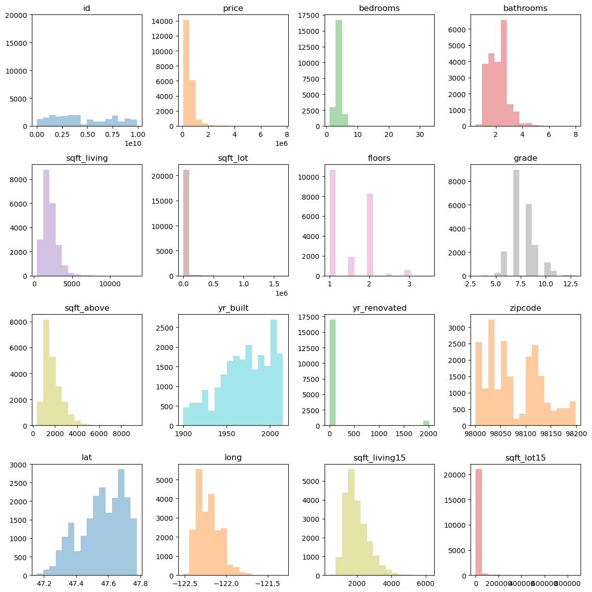
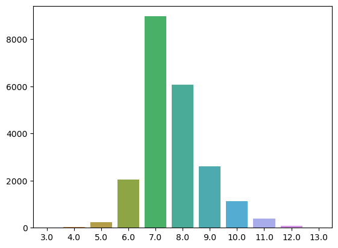
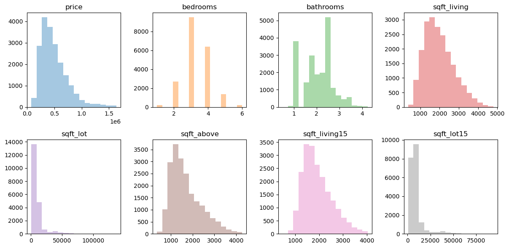
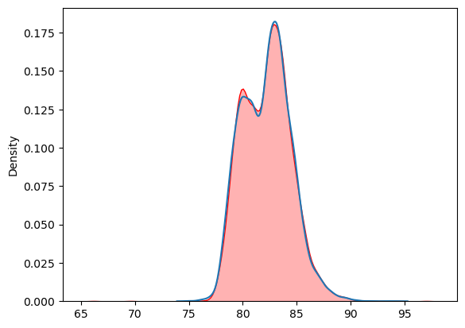
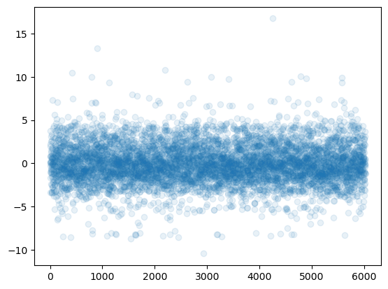
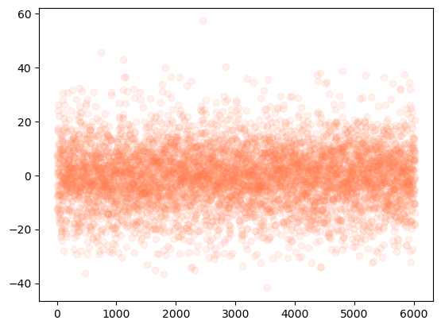
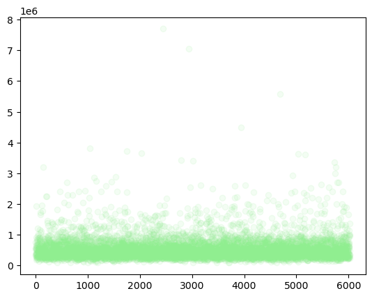

# Phase 2 Final Project
## King County, WA Development Project


### Business Understanding
The client is an NGO based in the Seattle area working in community outreach and development. They 
are interested in gaining deeper insight into the communities in and around King County with the hopes
of better focusing investment for _maximum impact_.

The NGO board has identified Life Expectancy as a primary metric to locate and understands areas
around the county that require investment. Further, they are interested in local property markets as
an indicator of communities general economic health and as a indicator for the effect size they can
expect their investments to have on those communities.

### The Data
To investigate this topic I used a primary dataset collected by the King County Assessors office, and
one secondary dataset compiled as part of the Land Conservation Intiative (LCI) opportunity are analysis.

The Kings County Property Sales data was collected from 2014 through 2015. 

The LCI dataset is a combination of several datasets from Public Health, the American Communities
Survey, and localization data as part of King County's Open Data program. The date range on the data
combined in this set are 2014 - 2019.

Let's start prepping the data!



### Data Preparation


```python
import pandas as pd
import numpy as np
from matplotlib import pyplot as plt
import seaborn as sns
import scipy.stats as stats
```


```python
df = pd.read_csv('./data/kc_house_data.csv')

df.head()
```


<div>
<style scoped>
    .dataframe tbody tr th:only-of-type {
        vertical-align: middle;
    }

    .dataframe tbody tr th {
        vertical-align: top;
    }

    .dataframe thead th {
        text-align: right;
    }
</style>
<table border="1" class="dataframe">
  <thead>
    <tr style="text-align: right;">
      <th></th>
      <th>id</th>
      <th>date</th>
      <th>price</th>
      <th>bedrooms</th>
      <th>bathrooms</th>
      <th>sqft_living</th>
      <th>sqft_lot</th>
      <th>floors</th>
      <th>waterfront</th>
      <th>view</th>
      <th>...</th>
      <th>grade</th>
      <th>sqft_above</th>
      <th>sqft_basement</th>
      <th>yr_built</th>
      <th>yr_renovated</th>
      <th>zipcode</th>
      <th>lat</th>
      <th>long</th>
      <th>sqft_living15</th>
      <th>sqft_lot15</th>
    </tr>
  </thead>
  <tbody>
    <tr>
      <th>0</th>
      <td>7129300520</td>
      <td>10/13/2014</td>
      <td>221900.0</td>
      <td>3</td>
      <td>1.00</td>
      <td>1180</td>
      <td>5650</td>
      <td>1.0</td>
      <td>NaN</td>
      <td>NONE</td>
      <td>...</td>
      <td>7 Average</td>
      <td>1180</td>
      <td>0.0</td>
      <td>1955</td>
      <td>0.0</td>
      <td>98178</td>
      <td>47.5112</td>
      <td>-122.257</td>
      <td>1340</td>
      <td>5650</td>
    </tr>
    <tr>
      <th>1</th>
      <td>6414100192</td>
      <td>12/9/2014</td>
      <td>538000.0</td>
      <td>3</td>
      <td>2.25</td>
      <td>2570</td>
      <td>7242</td>
      <td>2.0</td>
      <td>NO</td>
      <td>NONE</td>
      <td>...</td>
      <td>7 Average</td>
      <td>2170</td>
      <td>400.0</td>
      <td>1951</td>
      <td>1991.0</td>
      <td>98125</td>
      <td>47.7210</td>
      <td>-122.319</td>
      <td>1690</td>
      <td>7639</td>
    </tr>
    <tr>
      <th>2</th>
      <td>5631500400</td>
      <td>2/25/2015</td>
      <td>180000.0</td>
      <td>2</td>
      <td>1.00</td>
      <td>770</td>
      <td>10000</td>
      <td>1.0</td>
      <td>NO</td>
      <td>NONE</td>
      <td>...</td>
      <td>6 Low Average</td>
      <td>770</td>
      <td>0.0</td>
      <td>1933</td>
      <td>NaN</td>
      <td>98028</td>
      <td>47.7379</td>
      <td>-122.233</td>
      <td>2720</td>
      <td>8062</td>
    </tr>
    <tr>
      <th>3</th>
      <td>2487200875</td>
      <td>12/9/2014</td>
      <td>604000.0</td>
      <td>4</td>
      <td>3.00</td>
      <td>1960</td>
      <td>5000</td>
      <td>1.0</td>
      <td>NO</td>
      <td>NONE</td>
      <td>...</td>
      <td>7 Average</td>
      <td>1050</td>
      <td>910.0</td>
      <td>1965</td>
      <td>0.0</td>
      <td>98136</td>
      <td>47.5208</td>
      <td>-122.393</td>
      <td>1360</td>
      <td>5000</td>
    </tr>
    <tr>
      <th>4</th>
      <td>1954400510</td>
      <td>2/18/2015</td>
      <td>510000.0</td>
      <td>3</td>
      <td>2.00</td>
      <td>1680</td>
      <td>8080</td>
      <td>1.0</td>
      <td>NO</td>
      <td>NONE</td>
      <td>...</td>
      <td>8 Good</td>
      <td>1680</td>
      <td>0.0</td>
      <td>1987</td>
      <td>0.0</td>
      <td>98074</td>
      <td>47.6168</td>
      <td>-122.045</td>
      <td>1800</td>
      <td>7503</td>
    </tr>
  </tbody>
</table>
<p>5 rows × 21 columns</p>
</div>


### Starting Out
Here I start exploring the data and getting a sense of what is included in the data we have access 
to and what sorts of adjustments, or cleaning I am going to need to do to get started.

**Some notes:**
- The string columns are:
1. Date
2. Waterfront
3. View
4. Condition
5. Grade
6. Sqft_basement

- Something I noticed is that `sqft_above` is an `int` value and `sqft_basement` is a string value.
- There seem to be few if any NaN values in the table.


```python
df.info()
```

    <class 'pandas.core.frame.DataFrame'>
    RangeIndex: 21597 entries, 0 to 21596
    Data columns (total 21 columns):
     #   Column         Non-Null Count  Dtype  
    ---  ------         --------------  -----  
     0   id             21597 non-null  int64  
     1   date           21597 non-null  object 
     2   price          21597 non-null  float64
     3   bedrooms       21597 non-null  int64  
     4   bathrooms      21597 non-null  float64
     5   sqft_living    21597 non-null  int64  
     6   sqft_lot       21597 non-null  int64  
     7   floors         21597 non-null  float64
     8   waterfront     19221 non-null  object 
     9   view           21534 non-null  object 
     10  condition      21597 non-null  object 
     11  grade          21597 non-null  object 
     12  sqft_above     21597 non-null  int64  
     13  sqft_basement  21597 non-null  object 
     14  yr_built       21597 non-null  int64  
     15  yr_renovated   17755 non-null  float64
     16  zipcode        21597 non-null  int64  
     17  lat            21597 non-null  float64
     18  long           21597 non-null  float64
     19  sqft_living15  21597 non-null  int64  
     20  sqft_lot15     21597 non-null  int64  
    dtypes: float64(6), int64(9), object(6)
    memory usage: 3.5+ MB

#### Breaking Things Down
The first thing I want to do is identify data types and start to parse out how things are related. in
This section I will discuss the ways that I appraoched this. The parts that worked and the parts that
didn't.

1. I used **pairplots** and commonsense to identify possible colinearities between the data columns.
2. I wrote a series of functions that helped reorganize and rationalize the data more toward my use cases.
    * i.e. I wrote a latitude and longitude binning function that let me merge the two data sets of
      of different sizes and types of data into a single dataframe.
    * I wrote a function that cleaned and expanded my categorical data from the LCI set so that when
      it was grouped I was able to maintain the record of that data in a column that could then be
      expanded after the merge. Essentially, I think this may have been similar to a column expansion
      operation.
3. I wrote a lot of boiler plate code and am refactoring it into reusable blocks.
    * I wrote a helper function for visualizing a large dataframe. It takes the dataframe as an argument
      and a list containing the column names of the columns you want to graph from it. Then it dynamically
      creates a 2-d array of axes objects automatically determining the best size grid to fit
      them.
        * I want to expand this into a more general solution. One that can just be given any dataframe
          and determine based on the datatypes in each column the best way to return that column as a
          graph.
        * It seems like it would be fun and useful to have a tool similar to `pd.df.info()` or `describe()`
          but for graphing.

#### Dealing with Outliers

Below is a little bit of the process I used to take care of outliers. it resulted in a much more
normal distribution for most of the numerical categories. I wasted most of today investigating the
the sqft_lot and sqft_lot15 columns and why they are retaining so much skew after normalization.

I want to figure out how to take something like a derivative of the distribution to test how the 
features are actually structured. Made some progress toward that but it is now 2am.

**Making Colors Nice**
```python
colors = list(mcolors.TABLEAU_COLORS.keys())
while len(colors) < num_of_columns:
    rand_index = np.random.randint(0, len(colors))
    colors.append(colors[rand_index])
```
#### My Graph Tool
Below is the import for my graphing tool. I don't have time to document it now, but I'll revist this
notebook after graduation and clean everything up.

```python
from graph_tool import make_array
```


```python
house_num_col = list(house_num.columns)
column_name = iter(house_num_col)
color = iter(colors)
num_of_columns = len(house_num_col)
graph_shape = make_array(num_of_columns, 4)
fig, ax = plt.subplots(len(graph_shape), len(graph_shape[0]), figsize=(12, 12))
ax[0, 0].hist(x=house_num['price'])
fig.set_edgecolor(color='black')
fig.set_tight_layout(tight=True)
for row, obj in enumerate(graph_shape):
    for col in obj:
        name = next(column_name)
        ax[row, col].hist(x=house_num[name], bins=16, color=next(color), alpha=.4)
        ax[row, col].set_title(name)
        # print(row, col, next(column_gen), next(color))
plt.show()
```





```python
data= house_num['grade'].value_counts()
x = list(data.index)
y = list(data)
sns.barplot(x=x, y=y)
plt.show()
```



```python
def outlier_filter(df):
    col_names = list(df.select_dtypes([np.int64, np.float64]).columns)
    new_df = df
    for col in col_names:
        num = 8
        std = df[col].std()
        med = df[col].median()
        new_df = new_df[(df[col] > med-(num*std)) & (df[col] < med+(num*std))]
    return new_df
```
    


#### Encoding Data
This data is from the LCI source. One of the columns contained "Present Use" data for the parcel in
each row.

I split the numerical and categorical data before merging it into the Primary Dataframe and then
aggregated the rows when grouping on the Coordinate Bins so that I ended up with a list like the one
below in each row of this column:

```python
# def dict_to_columns(df, col_name):
cat_data['PREUSE_DESC'][134]
```


    ['Condominium(Residential)                          ',
     'Condominium(Residential)                          ',
     'Condominium(Residential)                          ',
     'Single Family(Res Use/Zone)                       ',
     '4-Plex                                            ',
     'Apartment                                         ',
     ...
     'Townhouse Plat                                    ',
     'Townhouse Plat                                    ',
     'Townhouse Plat                                    ',
     'Single Family(Res Use/Zone)                       ',
     'Single Family(Res Use/Zone)                       ',
     'Townhouse Plat                                    ',
     'Condominium(Residential)                          ',
     'Condominium(Residential)                          ',
     'Condominium(Residential)                          ']


#### Counting and Expanding
With a similar in each row I now needed to "sum" these values to represent the aggregate value for
each Bin Group.

The functions below can be applied to each row of the column to turn the list of repeated values into
a dictionary with the value counts for each category in the list.

```python

def counter(a_list):
    result = {}
    unique = list(set(a_list))
    for item in unique:
        count = a_list.count(item)
        try:
            id = item.rstrip()
        except AttributeError:
            continue
        if id == "":
            continue
        result.update({f'{id}': count})
    return result

def key_counter(count_dict):
    for key, val in count_dict.items():
        try:
            master_count[key] = master_count[key] + val
        except KeyError:
            master_count.update({key: val})
```
**Then I map the functions to the column, and print a list of total values for these categories contained
in the original dataset before grouping**.

```python
master_count = {}
new_col_names = []
cat_data['use_counts'] = cat_data['PREUSE_DESC'].map(counter)
cat_data['use_counts'].map(key_counter)
master_list = list(master_count.items())
master_list.sort(reverse=True, key=lambda x : x[1])
for item, count in master_list:
    if count > 1000:
        new_col_names.append(item)
        print(f"{item}: {count}")
```

    Single Family(Res Use/Zone): 950089
    Townhouse Plat: 120831
    Vacant(Single-family): 34433
    Duplex: 17419
    Apartment: 14000
    Single Family(C/I Zone): 6335
    Triplex: 6117
    Condominium(Residential): 5292
    4-Plex: 4273
    Mobile Home: 3159
    Retail Store: 2804
    Vacant(Multi-family): 2657
    Office Building: 2380
    Apartment(Mixed Use): 2208
    Vacant(Commercial): 2052
    Church/Welfare/Relig Srvc: 1905
    Parking(Assoc): 1320
    Park, Public(Zoo/Arbor): 1152
    

#### The Last Step
Here I am defining the last couple functions needed for this operation.

`handler` checks to make sure the dictionary containing the counts from our above list is there and
if it is it routes the value into newcolumn with the dictionary key as its name.

```python
def handler(col_name, col_dict):
    if col_name in col_dict.keys():
        return col_dict[col_name]
    return 0

def dict_to_col(df, name_list):
    for name in name_list:
        df[name] = df.apply(lambda x : handler(name, x['use_counts']), axis=1)

# exectute the operation. 
dict_to_col(cat_data, new_col_names)
```

#### The End
And then we're done! Now we have a new set of columns that represent all of the categorical data from the
Present Use column in our original dataset and we haven't lost any of the information after the
grouping and merging on the nurmerical Dataframe.

### Merging and Setting up the Test/Train Split
I am going to kind gloss over this for now.

I was working in maybe 15 different notebooks and would switch when they started to become unmanagably
long, but I will recombine and align them along the narrative at a later date.

## Model Tests
My first or second model attempting to get a prediction on Life Expectancy.

### Model 1
```python
run -i model03.py
```

    id                      :  -0.004668  |
    price                   :   0.739497  |
    sqft_living             :  -0.361522  |
    sqft_lot                :  -0.057240  |
    grade                   :   0.142520  |
    yr_built                :  -0.218601  |
    lat                     :   0.627254  |
    sqft_living15           :   0.085145  |
    sqft_lot15              :  -0.074418  |
    bins                    :  -0.420045  |
    POC_pct                 :   1.153714  |
    median_income           :  -0.132929  |
    TREE_PCT                :  -0.132692  |
    osdist_mean             :   0.100125  |
    os_per_person_pctle     :  -0.276935  |
    longitude               :  -0.019307  |
    Shape_Area              :   0.229707  |
    PREUSE_DESC             :   0.001986  |
    Single Family(Res Use/Zone):   0.016150  |
    Townhouse Plat          :   0.104244  |
    Vacant(Single-family)   :   0.020079  |
    Duplex                  :  -0.036180  |
    Apartment               :   0.123427  |
    Single Family(C/I Zone) :   0.062854  |
    Triplex                 :  -0.036127  |
    Condominium(Residential):  -0.157482  |
    4-Plex                  :   0.024960  |
    Mobile Home             :   0.052849  |
    Retail Store            :   0.020947  |
    Vacant(Multi-family)    :   0.224054  |
    Office Building         :   0.016554  |
    Apartment(Mixed Use)    :   0.003203  |
    Vacant(Commercial)      :   0.017612  |
    Church/Welfare/Relig Srvc:  -0.029823  |
    ----------------------------------------
    Training intercept      : 82.190092
    Training r_sq score     : 0.503081
    Mean Absolute Error     : 1.751840
    Root Mean Sq Error      : 2.296161
    

```python
sns.kdeplot(train_pred_le2, alpha=.3)
sns.kdeplot(y_pred_le2, fill=True, color='red', alpha=.3)
plt.show()
```




```python
resid_le2 = y_test_le2 - y_pred_le2
# print(len(y_test_le2), len(y_pred_le2), len(resid_le2))
fig, ax = plt.subplots()
ax.scatter(x=range(y_pred_le2.shape[0]),y=resid_le2, alpha=0.1);
plt.show()
```


```python
run -i model06.py
```

    price                   :  -3.745926  |
    sqft_living             :   1.642800  |
    sqft_lot                :   0.681374  |
    yr_built                :   1.196240  |
    sqft_living15           :   1.013943  |
    sqft_lot15              :   1.786108  |
    bins                    :  -2.032365  |
    POC_pct                 :   0.866011  |
    median_income           :  -0.596829  |
    LifeExpectancy          :   0.595129  |
    osdist_mean             :   4.099845  |
    os_per_person_pctle     :   4.925862  |
    longitude               :   2.432153  |
    latitude                :  -0.055143  |
    Shape_Area              :  -2.580435  |
    PREUSE_DESC             :  -0.412106  |
    Single Family(Res Use/Zone):   0.327542  |
    Townhouse Plat          :  -0.285114  |
    Vacant(Single-family)   :  -0.131323  |
    Duplex                  :  -0.683825  |
    Apartment               :   0.355417  |
    Single Family(C/I Zone) :  -0.599532  |
    Triplex                 :  -0.696121  |
    Condominium(Residential):   0.099225  |
    4-Plex                  :  -0.250894  |
    Mobile Home             :   0.095317  |
    Retail Store            :  -0.390760  |
    Vacant(Multi-family)    :   0.180432  |
    Office Building         :  -0.528248  |
    Apartment(Mixed Use)    :  -0.158147  |
    Vacant(Commercial)      :  -0.494629  |
    Church/Welfare/Relig Srvc:  -0.206831  |
    ----------------------------------------
    Model trian score       : 0.550543
    Model test score        : 0.539444
    Model intercept         : 33.420800
    Model r_sq score        : 0.550543
    Mean Absolute Error     : 554075.437474
    Mean Sq Error Train     : 11.220377
    Mean Sq Error Test      : 10.882046
    Mean Sq Error Diff      : 0.338331
    


```python
resid_t01 = y_test_t01 - y_test_pred_t01
# print(len(y_test_t01), len(y_pred_t01), len(resid_t01))
fig, ax = plt.subplots()
ax.scatter(x=range(y_test_pred_t01.shape[0]),y=resid_t01, color='coral',  alpha=0.1);
plt.show()
```





```python
run -i model_life_ex_01.py
```

    price                   :   0.822755  |
    sqft_living             :  -0.350384  |
    sqft_lot                :  -0.136434  |
    bins                    :  -0.466828  |
    POC_pct                 :   1.208713  |
    median_income           :  -0.227466  |
    TREE_PCT                :  -0.169396  |
    osdist_mean             :   0.061875  |
    os_per_person_pctle     :  -0.395556  |
    longitude               :   0.672996  |
    latitude                :   0.006453  |
    Vacant(Single-family)   :   0.026493  |
    Apartment               :   0.053237  |
    Condominium(Residential):  -0.005184  |
    4-Plex                  :   0.071272  |
    Vacant(Multi-family)    :  -0.001428  |
    Office Building         :   0.233913  |
    ----------------------------------------
    Model trian score       : 0.488695
    Model test score        : 0.469140
    Model intercept         : 82.190092
    Model r_sq score        : 0.488695
    Mean Absolute Error     : 554026.663594
    Mean Sq Error Train     : 2.262861
    Mean Sq Error Test      : 2.312613
    Mean Sq Error Diff      : 0.049751
    


```python
run -i model_life_ex02.py
```

    price                   :   0.833719  |
    sqft_living             :  -0.360626  |
    sqft_lot                :  -0.135397  |
    bins                    :  -0.463764  |
    POC_pct                 :   1.195224  |
    median_income           :  -0.232253  |
    TREE_PCT                :  -0.175662  |
    osdist_mean             :   0.054945  |
    os_per_person_pctle     :  -0.399031  |
    longitude               :   0.683447  |
    latitude                :   0.006327  |
    Vacant(Single-family)   :   0.018216  |
    Office Building         :   0.254087  |
    ----------------------------------------
    Model trian score       : 0.487691
    Model test score        : 0.466680
    Model intercept         : 82.190092
    Model r_sq score        : 0.487691
    Mean Absolute Error     : 554026.663594
    Mean Sq Error Train     : 2.265083
    Mean Sq Error Test      : 2.317966
    Mean Sq Error Diff      : 0.052883
    

## Third Version of the model
Even with all the variables in it's still only getting toward a %50 explination value for the 
variance in my training data.


```python
run -i model_life_ex03.py
```

    price                   :   1.139433  |
    sqft_living             :  -0.284965  |
    sqft_lot                :  -0.020515  |
    grade                   :  -0.006116  |
    sqft_above              :  -0.322965  |
    sqft_living15           :   0.085369  |
    sqft_lot15              :  -0.138030  |
    POC_pct                 :  -0.460402  |
    median_income           :   1.063076  |
    TREE_PCT                :  -0.053785  |
    osdist_mean             :  -0.019653  |
    os_per_person_pctle     :   0.052579  |
    longitude               :  -0.152452  |
    latitude                :   0.238275  |
    Shape_Area              :   0.093486  |
    Single Family(Res Use/Zone):   0.197502  |
    Townhouse Plat          :  -0.099342  |
    Vacant(Single-family)   :   0.000788  |
    Duplex                  :   0.136813  |
    Apartment               :   0.105723  |
    Single Family(C/I Zone) :   0.012633  |
    Triplex                 :   0.004708  |
    Condominium(Residential):  -0.007958  |
    4-Plex                  :  -0.001327  |
    Mobile Home             :  -0.090309  |
    Retail Store            :  -0.049221  |
    Vacant(Multi-family)    :  -0.004983  |
    Office Building         :  -0.052206  |
    Apartment(Mixed Use)    :   0.095634  |
    Vacant(Commercial)      :   0.080392  |
    Church/Welfare/Relig Srvc:   0.000000  |
    Parking(Assoc)          :   0.008222  |
    Park, Public(Zoo/Arbor) :   0.000000  |
    ----------------------------------------
    Model trian score       : 0.528839
    Model test score        : 0.513588
    Model intercept         : 81.876177
    Model r_sq score        : 0.528839
    Mean Absolute Error     : 1.584966
    Mean Sq Error Train     : 2.036806
    Mean Sq Error Test      : 2.066766
    Mean Sq Error Diff      : 0.029960




## In the END
In the end I wasn't really able to find much of anything. I'm going to keep working on it though and
I will revist this project and repo when I have time to turn it into something that acutally works
and makes sense.
